Pour créer un document d'architecture informatique détaillé pour le projet "Conception d'une IA spécifique aux données de l'entreprise WXYZ," basé sur le backlog fourni, nous allons suivre une structure organisée en sections. Chacune de ces sections inclura des diagrammes explicatifs et une description textuelle pour clarifier l'architecture du système.

### 1. Introduction

Le projet consiste en la conception d'une Intelligence Artificielle (IA) spécialisée dans l'analyse des données spécifiques de l'entreprise WXYZ. Cette IA doit s'intégrer dans l'écosystème existant de l'entreprise tout en assurant la sécurité, l'efficacité, et la scalabilité des opérations.

---

### 2. Architecture Logique

**Composants Logiciels et Organisation :**

L'architecture logique décrit les composants logiciels principaux, leur organisation et leurs interactions.

- **Moteur IA** : Le cœur du système, responsable de la collecte, normalisation, et analyse des données.
- **Module de Collecte de Données** : Connecté aux sources de données internes et externes pour collecter les informations nécessaires.
- **Tableau de Bord** : Interface utilisateur pour la visualisation des données et des rapports générés par l'IA.
- **Rapport** : Module générant les rapports analytiques à partir des données traitées.

**Diagramme de Composants :**

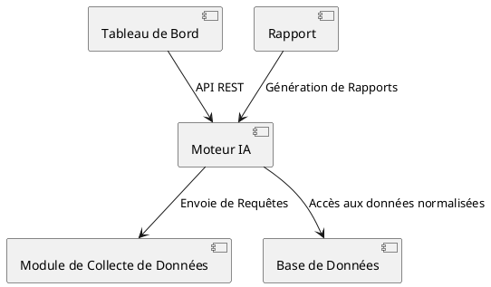

**Diagramme de Classes :**

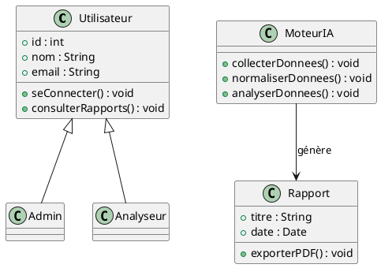

---

### 3. Architecture Technique

**Infrastructure Matérielle et Logicielle :**

L'architecture technique précise l'infrastructure matérielle et logicielle du système. Elle inclut les serveurs, bases de données, et réseaux.

- **Serveur Front-End** : Héberge l'interface utilisateur du Tableau de Bord.
- **Serveur Back-End** : Exécute les algorithmes de l'IA et le traitement des données.
- **Base de Données** : Stocke les données collectées, les résultats des analyses, et les rapports.

**Diagramme d'Infrastructure :**

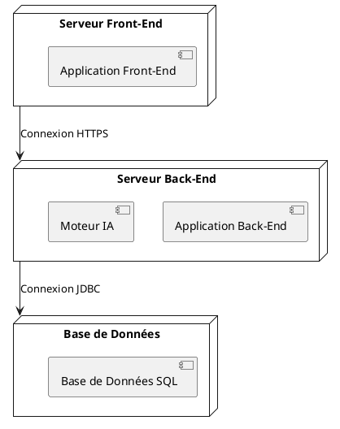

**Diagramme de Déploiement :**

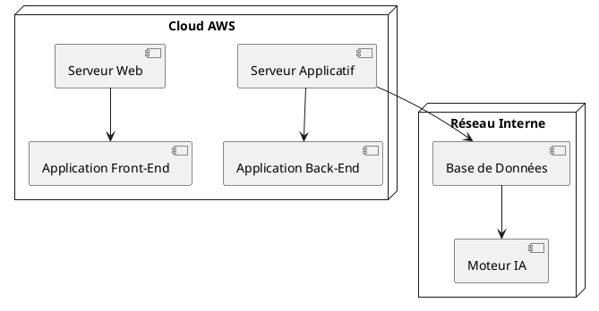

**Diagramme de Flux de Données :**

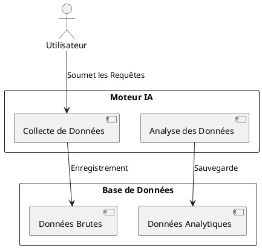

---

### 4. Architecture Applicative

**Structure des Applications :**

L'architecture applicative décrit la structure des applications, modules, et services utilisés. Cette section inclut les processus métier principaux sous forme de diagrammes.

**Diagramme de Séquence :**

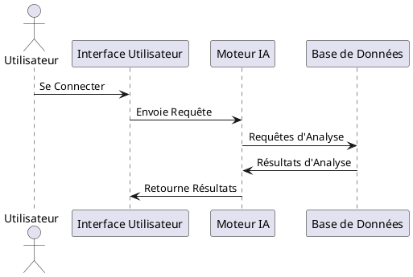

**Diagramme d'Activités :**

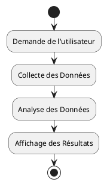

**Diagramme d'État :**

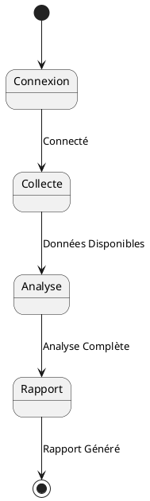

---

### 5. Architecture de Sécurité

**Mécanismes de Sécurité :**

L'architecture de sécurité décrit les mécanismes pour assurer la confidentialité, l'intégrité, et la disponibilité du système.

- **Authentification** : Utilisation de OAuth 2.0 pour sécuriser l'accès.
- **Autorisation** : Rôles et permissions pour contrôler l'accès aux fonctionnalités.
- **Chiffrement** : HTTPS pour toutes les communications, chiffrement des données sensibles en base de données.

**Diagramme de Sécurité :**

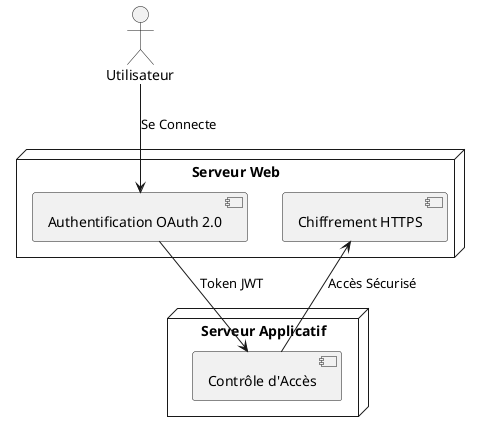

---

### 6. Architecture d'Intégration

**Interfaces entre les Systèmes :**

Cette section décrit les interfaces entre les différents composants et systèmes externes.

**Diagramme d'Intégration :**

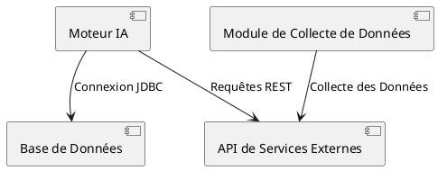

---

### 7. Vue d'Ensemble

**Schéma Global de l'Architecture :**

Le schéma global combine tous les éléments précédents pour offrir une vue d'ensemble du système.

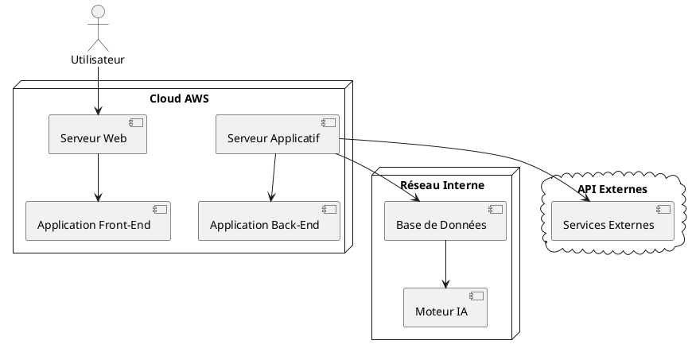

---

### Conclusion

Ce document d'architecture fournit une vue d'ensemble complète du projet de conception d'une IA pour l'entreprise WXYZ. Il est structuré de manière à couvrir tous les aspects critiques, de l'organisation des composants logiciels à l'infrastructure technique et à la sécurité. Les diagrammes PlantUML inclus permettent de visualiser clairement les relations et interactions entre les différents éléments du système. 

Chaque section est conçue pour faciliter la compréhension et la mise en œuvre du projet tout en assurant l'alignement avec les besoins métier et les meilleures pratiques en matière de développement logiciel.
